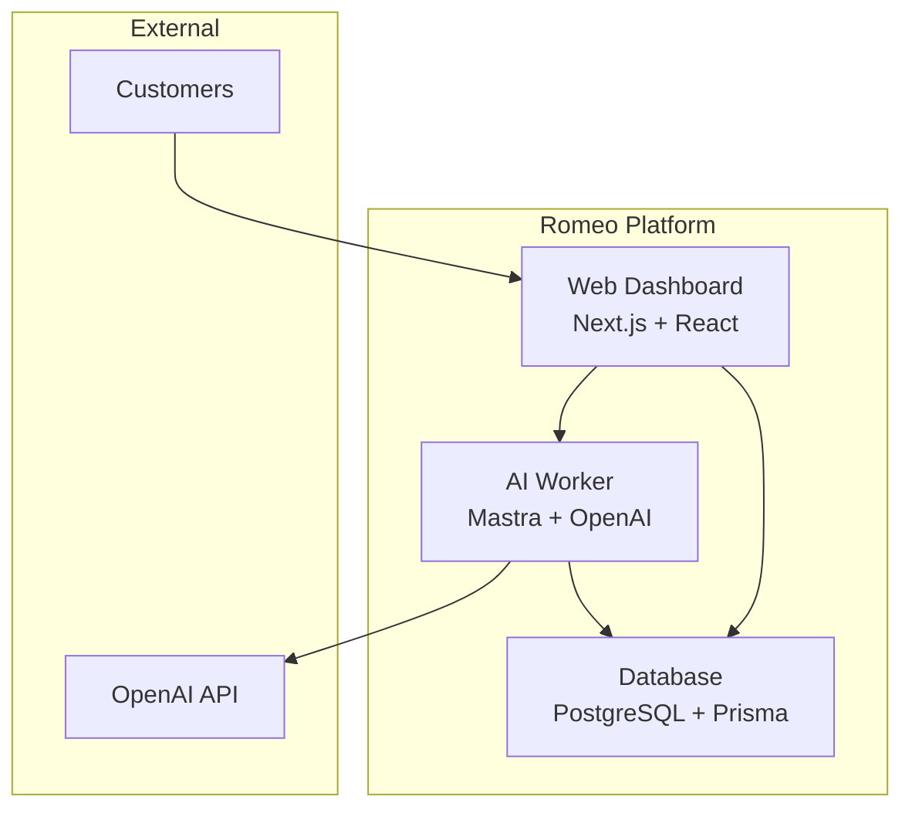

# Romeo 🤖

### Open-Source Self-Hostable TypeScript AI Agent for Customer Service

[](https://docs.docker.com/)
[](https://www.typescriptlang.org/)
[](https://nextjs.org/)
[](https://prisma.io/)

Romeo is a production-ready, open-source customer service AI platform that you can deploy anywhere. Built with TypeScript, powered by [Mastra](https://mastra.ai/), and designed for enterprise-grade reliability, Romeo provides intelligent customer support with full control over your data.

---

## ✨ Why Romeo?

- **🔒 Complete Data Control** - Self-host on your infrastructure, keep sensitive customer data private
- **⚡ Production Ready** - Built for scale with Docker, PostgreSQL, and enterprise-grade architecture  
- **🧠 Intelligent Memory** - Persistent conversation history and context across customer interactions
- **📊 Real-time Dashboard** - Monitor agent performance, manage customers, and track interactions
- **🔧 Framework Agnostic** - Powered by Mastra with support for any LLM provider (OpenAI, Anthropic, etc.)
- **🚀 One-Click Deploy** - Docker Compose setup gets you running in minutes

---

## 🏗️ Architecture

Romeo is built as a modern monorepo with three core components:



### Components

- **🌐 Web Dashboard** - Next.js application for customer management and agent monitoring
- **🤖 AI Worker** - Fastify server running the Romeo customer service agent
- **📊 Database** - PostgreSQL with Prisma for customer data and conversation history
- **🔧 Mastra Integration** - Advanced AI framework providing memory, tool calling, and conversation management

---

## 🚀 Quick Start

### Prerequisites

- [Docker](https://docs.docker.com/get-docker/) and Docker Compose
- [OpenAI API Key](https://platform.openai.com/api-keys)

### 1. Clone and Setup

```bash
git clone https://github.com/your-org/romeo.git
cd romeo

# Copy environment template
cp docker.env.example docker.env
```

### 2. Configure Environment

Edit `docker.env` and add your OpenAI API key:

```bash
# Required: Add your OpenAI API key
OPENAI_API_KEY=your_openai_api_key_here

# Optional: Customize model (default: gpt-4o-mini)
OPENAI_MODEL=gpt-4o-mini
```

### 3. Launch Romeo

```bash
# Start all services
docker-compose up -d

# Watch logs
docker-compose logs -f
```

### 4. Access Romeo

- **Dashboard**: http://localhost:3000
- **API Worker**: http://localhost:3030
- **Database**: localhost:5432

---

## 💡 Features

### 🤖 Intelligent Customer Service Agent

Romeo's AI agent is specifically trained for customer service excellence:

- **Professional Communication** - Maintains helpful, empathetic tone
- **Context Awareness** - Remembers conversation history and customer details
- **Problem Resolution** - Trained to understand and solve customer issues
- **Escalation Management** - Knows when to involve human agents

### 📊 Management Dashboard

Monitor and manage your customer service operations:

- **Customer Database** - Centralized customer information and history
- **Real-time Monitoring** - Track agent performance and conversation metrics
- **Conversation History** - Full audit trail of customer interactions
- **Status Management** - Manage customer status and agent availability

### 🔧 Enterprise Features

Built for production deployment:

- **Scalable Architecture** - Horizontal scaling with multiple worker instances
- **Persistent Memory** - Conversation context preserved across sessions
- **Health Monitoring** - Built-in health checks and observability
- **Security** - Environment-based configuration, secure defaults

---

## 📚 Documentation

### Development Guides

- [Development Setup](./DEV_GUIDE.md) - Local development environment
- [Docker Guide](./DOCKER_PRISMA_GUIDE.md) - Docker and database setup
- [API Documentation](./worker/README.md) - Worker API reference

### Deployment

Romeo supports multiple deployment options:

| Environment | Guide | Best For |
|-------------|-------|----------|
| **Docker Compose** | [Quick Start](#quick-start) | Development, small teams |
| **Kubernetes** | *Coming Soon* | Production, enterprise |
| **Cloud Deploy** | *Coming Soon* | Managed hosting |

### Configuration

Romeo is highly configurable through environment variables:

```bash
# AI Configuration
OPENAI_API_KEY=your_key_here          # Required
OPENAI_MODEL=gpt-4o-mini              # Optional, default model

# Database
DATABASE_URL=postgresql://...         # Auto-configured in Docker

# Worker Service  
LOG_LEVEL=info                        # info, debug, warn, error
CORS_ORIGIN=*                         # CORS configuration

# Custom Ports (optional)
WEB_PORT=3000                         # Dashboard port
WORKER_PORT=3030                      # API worker port
POSTGRES_PORT=5432                    # Database port
```

---

## 🔌 Integrations

Romeo is designed to work with your existing infrastructure:

### LLM Providers
- ✅ **OpenAI** (GPT-4, GPT-3.5-turbo, GPT-4o-mini)
- 🔄 **Anthropic** (Coming Soon)
- 🔄 **Google Gemini** (Coming Soon)
- 🔄 **Azure OpenAI** (Coming Soon)

### Customer Platforms
- 🔄 **Zendesk Integration** (Planned)
- 🔄 **Intercom Integration** (Planned)
- 🔄 **Slack Bot** (Planned)
- 🔄 **Discord Bot** (Planned)

### Observability
- 🔄 **Phoenix Integration** (Planned)
- 🔄 **Langfuse Integration** (Planned)
- 🔄 **Custom Analytics** (Planned)

---

## 🛠️ Development

### Local Development

```bash
# Install dependencies
pnpm install

# Start development servers
pnpm dev

# Access services:
# - Web: http://localhost:3000
# - Worker: http://localhost:3030
# - Database: localhost:5432
```

### Project Structure

```
romeo/
├── web/                    # Next.js dashboard
│   ├── src/app/           # App router pages
│   ├── src/components/    # React components
│   └── src/lib/           # Utilities
├── worker/                 # AI agent service
│   ├── agent.ts           # Romeo agent definition
│   ├── routes/            # API routes
│   └── utils/             # Worker utilities
├── packages/
│   └── database/          # Shared database package
│       └── prisma/        # Database schema
└── docker-compose.yml     # Docker deployment
```

### Database Schema

Romeo uses a clean, focused database schema:

```typescript
model Customer {
  id        String   @id @default(cuid())
  email     String   @unique
  name      String
  phone     String?
  status    CustomerStatus @default(ACTIVE)
  metadata  Json?
  createdAt DateTime @default(now())
  updatedAt DateTime @updatedAt
}
```

---

## 🌟 Use Cases

### Small Business Customer Support
Perfect for businesses that need 24/7 customer support without the overhead of a large support team.

### Enterprise Customer Service
Deploy Romeo as part of your customer service infrastructure with full control over data and customization.

### Developer Platform Support  
Use Romeo to handle developer questions, API support, and technical documentation assistance.

### E-commerce Support
Handle order inquiries, product questions, and customer issues automatically.

---

## 🤝 Contributing

We welcome contributions! Romeo is built by the community, for the community.

### Ways to Contribute

- 🐛 **Report Bugs** - [Open an issue](https://github.com/your-org/romeo/issues)
- 💡 **Feature Requests** - [Share your ideas](https://github.com/your-org/romeo/discussions)
- 🔧 **Code Contributions** - [Submit a pull request](https://github.com/your-org/romeo/pulls)
- 📚 **Documentation** - Help improve our docs
- 🌍 **Community** - Join our [Discord community](https://discord.gg/romeo)

### Development Setup

```bash
# Clone the repo
git clone https://github.com/your-org/romeo.git
cd romeo

# Install dependencies
pnpm install

# Set up environment
cp docker.env.example .env

# Start services
pnpm dev
```

---

## 🏢 Enterprise

### Enterprise Features

- **Priority Support** - Direct access to our engineering team
- **Custom Integrations** - Built for your specific requirements  
- **Advanced Security** - SOC 2, GDPR compliance assistance
- **Dedicated Deployment** - Private cloud or on-premises installation
- **Training & Onboarding** - Comprehensive team training

### Get Enterprise Support

For enterprise deployments, custom development, or support:

- 📧 **Email**: enterprise@romeo.ai
- 📅 **Schedule a Demo**: [calendly.com/romeo-enterprise](https://calendly.com/romeo-enterprise)
- 💬 **Contact Sales**: [romeo.ai/enterprise](https://romeo.ai/enterprise)

---

## 📄 License

Romeo is open-source software licensed under the [MIT License](./LICENSE).

```
MIT License

Copyright (c) 2024 Romeo Contributors

Permission is hereby granted, free of charge, to any person obtaining a copy
of this software and associated documentation files (the "Software"), to deal
in the Software without restriction, including without limitation the rights
to use, copy, modify, merge, publish, distribute, sublicense, and/or sell
copies of the Software...
```

---

## 🙏 Acknowledgments

Romeo is built with amazing open-source technologies:

- **[Mastra](https://mastra.ai/)** - The TypeScript AI framework powering Romeo's intelligence
- **[Next.js](https://nextjs.org/)** - React framework for the dashboard
- **[Prisma](https://prisma.io/)** - Type-safe database toolkit
- **[Fastify](https://fastify.io/)** - Fast and low overhead web framework
- **[OpenAI](https://openai.com/)** - AI models for natural language processing

---

## ⭐ Star History

If Romeo helps your business, please consider giving us a star! ⭐

[](https://star-history.com/#your-org/romeo&Date)

---

<div align="center">

**[⬆ Back to Top](#romeo-)**

Made with ❤️ by the Romeo community

[Website](https://romeo.ai) • [Documentation](https://docs.romeo.ai) • [Discord](https://discord.gg/romeo) • [Twitter](https://twitter.com/romeo_ai)

</div>
