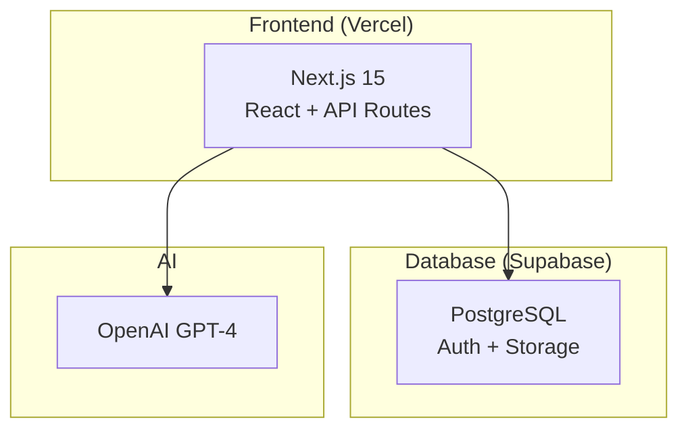

# Romeo 🤖

⭐ **Star this repo if you want to build CX Agent without complexity!**

### Modern TypeScript AI Customer Service Platform

[](https://nextjs.org/)
[](https://supabase.com/)
[](https://openai.com/)
[](https://www.typescriptlang.org/)
[](https://vercel.com/)

Romeo is a production-ready AI customer service platform built with the **modern simple stack** - designed for rapid development and effortless scaling.

---

## 🚀 The Modern Simple Stack

**Frontend & API**: Next.js 15 + API Routes (deployed on Vercel)  
**Database**: Supabase (PostgreSQL + Auth + Storage)  
**AI**: OpenAI GPT-4  
**ORM**: Prisma  
**Cost**: $0-50/month for thousands of users

### This Stack Powers:

- **Vercel**: Their own billion-dollar product
- **Hundreds of successful startups**

---

## ✨ Why This Approach?

### ⚡ Developer Experience First
```bash
# Get started in minutes
pnpm install
pnpm dev
# Deploy with one command
vercel deploy
sst deploy
```

### 📈 Smart Scaling Strategy:
- **1-1000 users**: Simple stack handles easily
- **1000-10000 users**: Same stack, just paying more  
- **10000+ users**: Scale infrastructure as needed (with revenue to support it)

**Focus on building features that customers love, not infrastructure complexity.**

---

## 🏗️ Architecture



---

## 🚀 Quick Start

### 1. Clone and Setup

```bash
git clone https://github.com/your-org/romeo.git
cd romeo
pnpm install
```

### 2. Set up Supabase

1. Go to [database.new](https://database.new)
2. Create a new project
3. Copy your credentials to `web/.env.local`:

```bash
# Supabase Configuration
NEXT_PUBLIC_SUPABASE_URL=your_supabase_project_url
NEXT_PUBLIC_SUPABASE_ANON_KEY=your_supabase_anon_key
SUPABASE_SERVICE_ROLE_KEY=your_supabase_service_role_key
DATABASE_URL=your_supabase_database_url

# OpenAI Configuration
OPENAI_API_KEY=your_openai_api_key_here
OPENAI_MODEL=gpt-4o-mini
```

### 3. Database Setup

```bash
cd packages/database
pnpm run db:push    # Push schema to Supabase
pnpm run db:studio  # Open Prisma Studio
```

### 4. Start Development

```bash
cd web
pnpm dev
```

Access at: http://localhost:3000

### 5. Deploy (Optional)

**Frontend (Vercel)**:

```bash
vercel deploy
```

---

## 💡 Features

### 🤖 AI Customer Service

- **GPT-4 Powered**: Professional, context-aware responses
- **Conversation Memory**: Persistent chat history
- **Smart Escalation**: Knows when to involve humans
- **Multi-Channel**: Web, API, future integrations

### 📊 Modern Dashboard

- **Real-time Metrics**: Customer stats, conversation tracking
- **Beautiful UI**: Tailwind CSS + Radix UI components
- **Responsive Design**: Works on all devices
- **Type-Safe**: Full TypeScript coverage

### 🔐 Production Ready

- **Supabase Auth**: Built-in authentication system
- **Row-Level Security**: Database-level permissions
- **Environment Config**: Secure credential management
- **Health Monitoring**: Built-in health checks

---

## 🛠️ Development

### Project Structure

```
romeo/
├── web/                    # Next.js app
│   ├── src/app/           # App router pages
│   ├── src/components/    # React components
│   ├── src/lib/           # Utilities
│   └── src/app/api/       # API routes
└── packages/database/      # Shared Prisma schema
```

### Key Commands

```bash
# Development
pnpm dev                   # Start Next.js dev server
pnpm db:studio            # Open database admin
pnpm db:push              # Push schema changes

# Deployment
vercel deploy             # Deploy frontend

# Database
pnpm db:generate          # Generate Prisma client
pnpm db:push              # Push schema to Supabase
```

---

## 🌟 Use Cases

### ✅ Perfect For:

- **Startups**: Get to market fast without DevOps overhead
- **SMBs**: Professional customer service without enterprise complexity
- **Side Projects**: MVP to production in hours, not weeks
- **Agencies**: Deliver client projects rapidly

### 🔄 Easy to Scale:

- **More Users**: Vercel/Supabase auto-scale
- **More Features**: Add API routes, database tables
- **Team Growth**: TypeScript + modern tools = easy onboarding

---

## 🎯 The OSS Philosophy

**Start Simple. Ship Fast. Scale When Needed.**

This project demonstrates the power of modern developer-friendly tools:
- **Next.js**: Powers Vercel ($1B+ valuation)
- **Supabase**: Handles millions of users daily
- **Vercel**: Serves 100B+ requests per month
- **AWS Lambda**: Scales to any load automatically

Focus on mastering customer problems, not infrastructure complexity.

---

## 🤝 Contributing

We welcome contributions! Romeo proves that simple architectures enable faster development.

### Quick Contribution Guide:

1. Fork the repo
2. Create a feature branch
3. Make your changes
4. Test with `pnpm dev`
5. Submit a PR

### Areas for Contribution:

- 🎨 UI/UX improvements
- 🔌 New integrations (Slack, Discord, etc.)
- 🤖 AI enhancements
- 📱 Mobile optimizations
- 📚 Documentation

---

## 📞 Support & Community

- **Discord**: [Join our community](https://discord.gg/romeo)
- **GitHub**: [Open an issue](https://github.com/your-org/romeo/issues)
- **Email**: hello@romeo.ai
- **Docs**: [Full documentation](https://docs.romeo.ai)

---

## 📄 License

MIT License - use it, modify it, ship it!

---

## 🙏 Built With

- **[Next.js](https://nextjs.org/)** - React framework
- **[Supabase](https://supabase.com/)** - Database + Auth + Storage
- **[OpenAI](https://openai.com/)** - AI models
- **[Prisma](https://prisma.io/)** - Type-safe database access

- **[Vercel](https://vercel.com/)** - Frontend deployment
- **[Tailwind CSS](https://tailwindcss.com/)** - Styling
- **[Radix UI](https://radix-ui.com/)** - Headless UI components

---

<div align="center">

**⭐ Star this repo if it helped you build faster!**

**[⬆ Back to Top](#romeo-)**

Made with ❤️ by developers who believe in simple solutions

[Website](https://romeo.ai) • [Demo](https://demo.romeo.ai) • [Discord](https://discord.gg/romeo) • [Twitter](https://twitter.com/romeo_ai)

</div>
